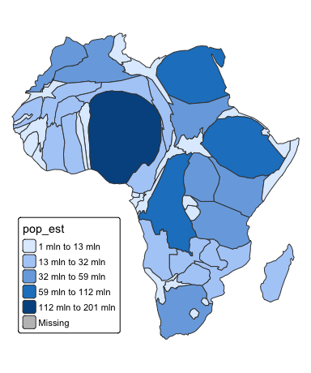

cartogram: Create Cartograms with R
================

<!-- badges: start -->

[](https://cran.r-project.org/package=cartogram)
[](https://github.com/sjewo/cartogram/actions/workflows/R-CMD-check.yaml)
[](https://cran.r-project.org/package=cartogram)
<!-- badges: end -->

Construct a continuous area cartogram by a rubber sheet distortion
algorithm (Dougenik et al. 1985), non-contiguous Area Cartograms (Olson
1976), and non-overlapping Circles Cartogram (Dorling el al. 1996) in R.

## Installation

You can install the **cartogram** package from CRAN as follows:

``` r
install.packages("cartogram")
```

To upgrade to the latest development version of `cartogram`, install the
package `remotes` and run the following command:

``` r
remotes::install_github("sjewo/cartogram")
```

## Examples

### Continuous Area Cartogram

``` r
library(cartogram)
library(sf)
#> Linking to GEOS 3.11.0, GDAL 3.5.3, PROJ 9.1.0; sf_use_s2() is TRUE
library(tmap)

data("World")

# keep only the african continent
afr <- World[World$continent == "Africa", ]

# project the map
afr <- st_transform(afr, 3395)

# construct cartogram
afr_cont <- cartogram_cont(afr, "pop_est", itermax = 5)
#>   |                                                                              |                                                                      |   0%  |                                                                              |==============                                                        |  20%  |                                                                              |============================                                          |  40%  |                                                                              |==========================================                            |  60%  |                                                                              |========================================================              |  80%  |                                                                              |======================================================================| 100%

# plot it
tm_shape(afr_cont) + tm_polygons("pop_est", style = "jenks") +
  tm_layout(frame = FALSE, legend.position = c("left", "bottom"))
#> 
#> ── tmap v3 code detected ───────────────────────────────────────────────────────
#> [v3->v4] `tm_polygons()`: instead of `style = "jenks"`, use fill.scale =
#> `tm_scale_intervals()`.
#> ℹ Migrate the argument(s) 'style' to 'tm_scale_intervals(<HERE>)'
```

<!-- -->

### Non-contiguous Area Cartogram

Many thanks to @rCarto and @neocarto for contributing the code!

``` r
# construct cartogram
afr_ncont <- cartogram_ncont(afr, "pop_est")
#>   |                                                                              |                                                                      |   0%  |                                                                              |=                                                                     |   2%  |                                                                              |===                                                                   |   4%  |                                                                              |====                                                                  |   6%  |                                                                              |=====                                                                 |   8%  |                                                                              |=======                                                               |  10%  |                                                                              |========                                                              |  12%  |                                                                              |==========                                                            |  14%  |                                                                              |===========                                                           |  16%  |                                                                              |============                                                          |  18%  |                                                                              |==============                                                        |  20%  |                                                                              |===============                                                       |  22%  |                                                                              |================                                                      |  24%  |                                                                              |==================                                                    |  25%  |                                                                              |===================                                                   |  27%  |                                                                              |=====================                                                 |  29%  |                                                                              |======================                                                |  31%  |                                                                              |=======================                                               |  33%  |                                                                              |=========================                                             |  35%  |                                                                              |==========================                                            |  37%  |                                                                              |===========================                                           |  39%  |                                                                              |=============================                                         |  41%  |                                                                              |==============================                                        |  43%  |                                                                              |================================                                      |  45%  |                                                                              |=================================                                     |  47%  |                                                                              |==================================                                    |  49%  |                                                                              |====================================                                  |  51%  |                                                                              |=====================================                                 |  53%  |                                                                              |======================================                                |  55%  |                                                                              |========================================                              |  57%  |                                                                              |=========================================                             |  59%  |                                                                              |===========================================                           |  61%  |                                                                              |============================================                          |  63%  |                                                                              |=============================================                         |  65%  |                                                                              |===============================================                       |  67%  |                                                                              |================================================                      |  69%  |                                                                              |=================================================                     |  71%  |                                                                              |===================================================                   |  73%  |                                                                              |====================================================                  |  75%  |                                                                              |======================================================                |  76%  |                                                                              |=======================================================               |  78%  |                                                                              |========================================================              |  80%  |                                                                              |==========================================================            |  82%  |                                                                              |===========================================================           |  84%  |                                                                              |============================================================          |  86%  |                                                                              |==============================================================        |  88%  |                                                                              |===============================================================       |  90%  |                                                                              |=================================================================     |  92%  |                                                                              |==================================================================    |  94%  |                                                                              |===================================================================   |  96%  |                                                                              |===================================================================== |  98%  |                                                                              |======================================================================| 100%

# plot it
tm_shape(afr) + tm_borders() +
  tm_shape(afr_ncont) + tm_polygons("pop_est", style = "jenks") +
  tm_layout(frame = FALSE, legend.position = c("left", "bottom"))
#> 
#> ── tmap v3 code detected ───────────────────────────────────────────────────────
#> [v3->v4] `tm_polygons()`: instead of `style = "jenks"`, use fill.scale =
#> `tm_scale_intervals()`.
#> ℹ Migrate the argument(s) 'style' to 'tm_scale_intervals(<HERE>)'
```

<!-- -->

### Non-Overlapping Circles Cartogram

Many thanks to @rCarto for contributing the code!

``` r
# construct cartogram
afr_dorling <- cartogram_dorling(afr, "pop_est")

# plot it
tm_shape(afr) + tm_borders() +
  tm_shape(afr_dorling) + tm_polygons("pop_est", style = "jenks") +
  tm_layout(frame = FALSE, legend.position = c("left", "bottom"))
#> 
#> ── tmap v3 code detected ───────────────────────────────────────────────────────
#> [v3->v4] `tm_polygons()`: instead of `style = "jenks"`, use fill.scale =
#> `tm_scale_intervals()`.
#> ℹ Migrate the argument(s) 'style' to 'tm_scale_intervals(<HERE>)'
```

<!-- -->

## Use multiple CPU cores

Many thanks to @e-kotov for contributing the code!

``` r
library(cartogram)
library(sf)
library(tmap)

library(future)
library(future.apply)
library(parallelly)

data("World")

# keep only the african continent
afr <- World[World$continent == "Africa", ]

# project the map
afr <- st_transform(afr, 3395)

# Create cartogram using 2 CPU cores on local machine
afr_cont <- cartogram_cont(afr, weight = "pop_est", 
                           itermax = 5, n_cpu = 2, 
                           show_progress = FALSE)

# plot it
tm_shape(afr_cont) + tm_polygons("pop_est", style = "jenks") +
  tm_layout(frame = FALSE, legend.position = c("left", "bottom"))
#> 
#> ── tmap v3 code detected ───────────────────────────────────────────────────────
#> [v3->v4] `tm_polygons()`: instead of `style = "jenks"`, use fill.scale =
#> `tm_scale_intervals()`.
#> ℹ Migrate the argument(s) 'style' to 'tm_scale_intervals(<HERE>)'
```

<!-- -->

## References

- Dorling, D. (1996). Area Cartograms: Their Use and Creation. In
  Concepts and Techniques in Modern Geography (CATMOG), 59.
- Dougenik, J. A., Chrisman, N. R., & Niemeyer, D. R. (1985). An
  Algorithm To Construct Continuous Area Cartograms. In The Professional
  Geographer, 37(1), 75-81.
- Olson, J. M. (1976), Noncontiguous Area Cartograms. The Professional
  Geographer, 28: 371–380.
  [doi:10.1111/j.0033-0124.1976.00371.x](https://doi.org/10.1111/j.0033-0124.1976.00371.x)
