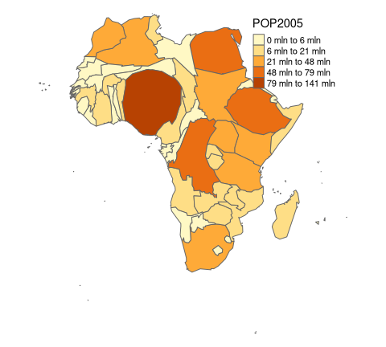
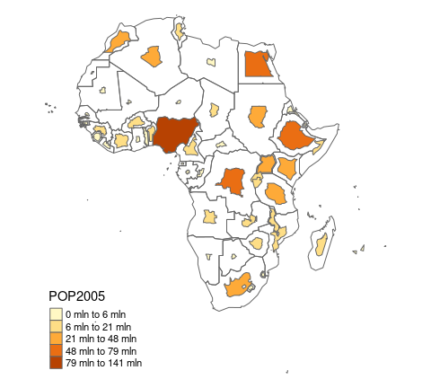
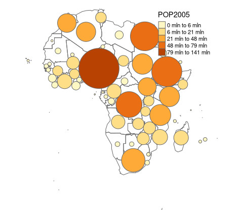

cartogram: Create Cartograms with R
================

[](https://cran.r-project.org/package=cartogram)
[](https://github.com/sjewo/cartogram/actions?workflow=R-CMD-check)
[](https://cran.r-project.org/package=cartogram)

Construct a continuous area cartogram by a rubber sheet distortion
algorithm (Dougenik et al. 1985), non-contiguous Area Cartograms (Olson
1976), and non-overlapping Circles Cartogram (Dorling el al. 1996) in R.

## Installation

You can install the **cartogram** package from CRAN as follows:

``` r
install.packages("cartogram")
```

To upgrade to the latest development version of `cartogram`, install the
package `devtools` and run the following command:

``` r
devtools::install_github("sjewo/cartogram")
```

## NEWS

- \[0.3.0\] Remove `sp`, `rgdal` and `maptools` from examples and
  suggestions. `cartogram_cont` has a new parameter `verbose = FALSE` to
  hide print of size error on each iteration.
- \[0.2.0\] Migrated all functions to sf, fixed problems with
  multipolygons. cartogram functions won’t accept features with
  longitude/latitude coordinates anymore.
- \[0.1.1\] Update sf code: Thanks to @Nowosad for speeding things up!
- \[0.1.0\] Non-Overlapping Circles Cartogram (Dorling)
- \[0.0.3\] sf support added
- \[0.0.2\] Non-contiguous Area Cartogram
- \[0.0.2\] Prepare data with missing or extreme values before cartogram
  calculation for faster convergence
- \[0.0.1\] Initial Release

## Examples

### Continuous Area Cartogram

``` r
library(cartogram)
library(sf)
#> Linking to GEOS 3.11.0, GDAL 3.5.3, PROJ 9.1.0; sf_use_s2() is TRUE
library(tmap)

data("World")

# keep only the african continent
afr <- World[World$continent == "Africa", ]

# project the map
afr <- st_transform(afr, 3395)

# construct cartogram
afr_cont <- cartogram_cont(afr, "pop_est", itermax = 5)

# plot it
tm_shape(afr_cont) + tm_polygons("pop_est", style = "jenks") +
  tm_layout(frame = FALSE, legend.position = c("left", "bottom"))
```

<!-- -->

### Non-contiguous Area Cartogram

Many thanks to @rCarto and @neocarto for contributing the code!

``` r
# construct cartogram
afr_ncont <- cartogram_ncont(afr, "pop_est")

# plot it
tm_shape(afr) + tm_borders() +
  tm_shape(afr_ncont) + tm_polygons("pop_est", style = "jenks") +
  tm_layout(frame = FALSE, legend.position = c("left", "bottom"))
```

<!-- -->

### Non-Overlapping Circles Cartogram

Many thanks to @rCarto for contributing the code!

``` r
# construct cartogram
afr_dorling <- cartogram_dorling(afr, "pop_est")

# plot it
tm_shape(afr) + tm_borders() +
  tm_shape(afr_dorling) + tm_polygons("pop_est", style = "jenks") +
  tm_layout(frame = FALSE, legend.position = c("left", "bottom"))
```

<!-- -->

## References

- Dorling, D. (1996). Area Cartograms: Their Use and Creation. In
  Concepts and Techniques in Modern Geography (CATMOG), 59.
- Dougenik, J. A., Chrisman, N. R., & Niemeyer, D. R. (1985). An
  Algorithm To Construct Continuous Area Cartograms. In The Professional
  Geographer, 37(1), 75-81.
- Olson, J. M. (1976), Noncontiguous Area Cartograms. The Professional
  Geographer, 28: 371–380.
  [doi:10.1111/j.0033-0124.1976.00371.x](https://doi.org/10.1111/j.0033-0124.1976.00371.x)
